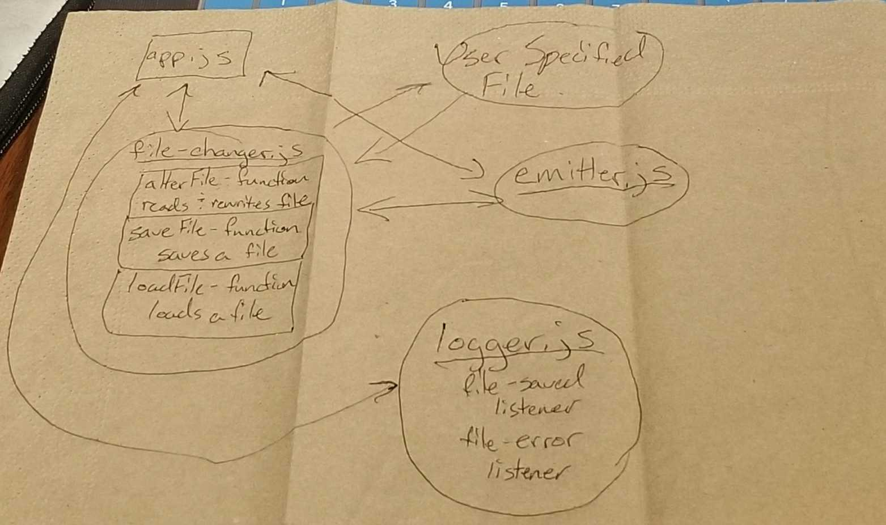

# LAB - 15

### Author: Morgan T Shaw

### Links and Resources
* [submission PR](https://github.com/morgan-401-advanced-javascript/lab15/pull/1)
* [travis](https://travis-ci.com/morgan-401-advanced-javascript/lab15)

#### Running the app
`node app.js <path-to-my-file>`
  
#### Tests
* How do you run tests?
npm test

#### UML
